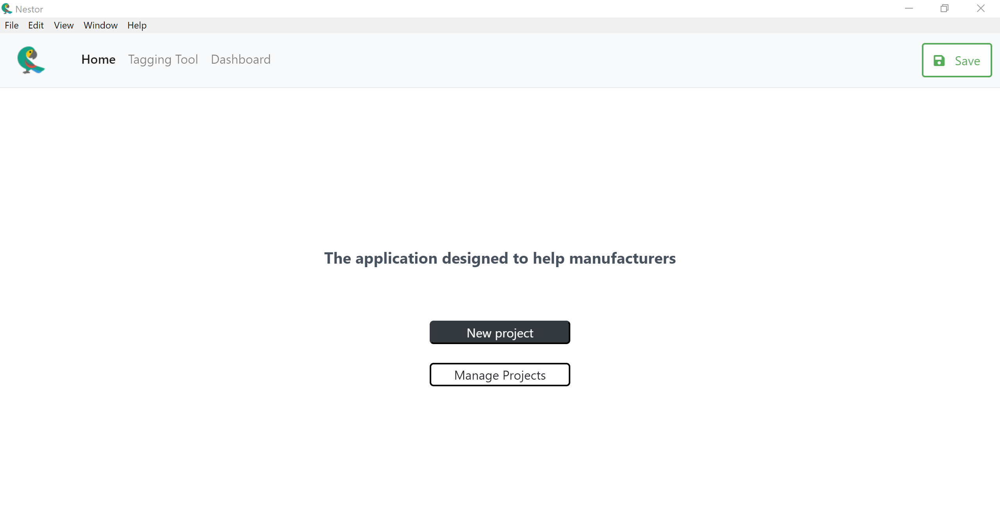
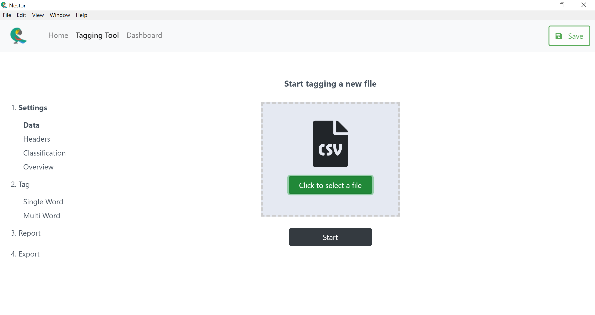
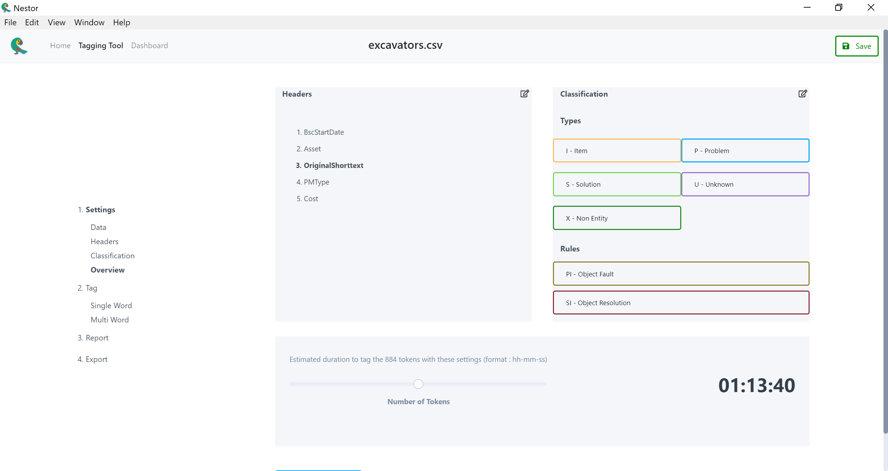
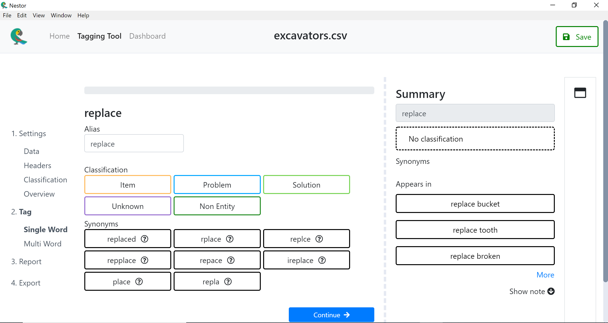
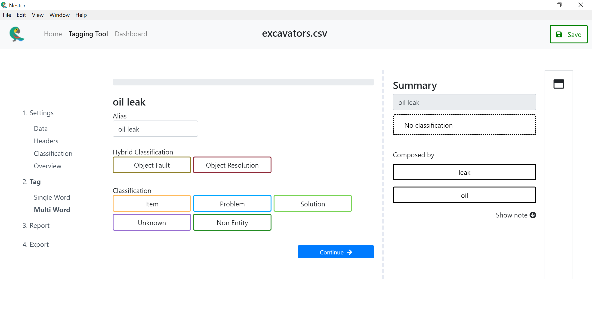
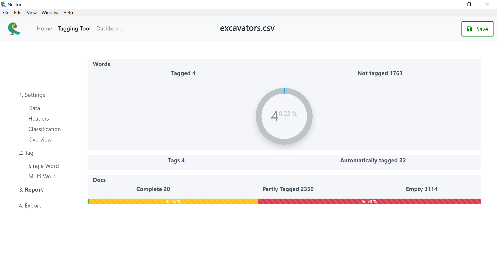
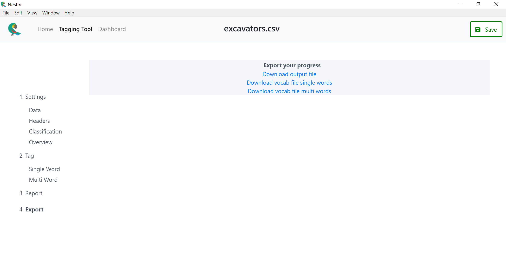
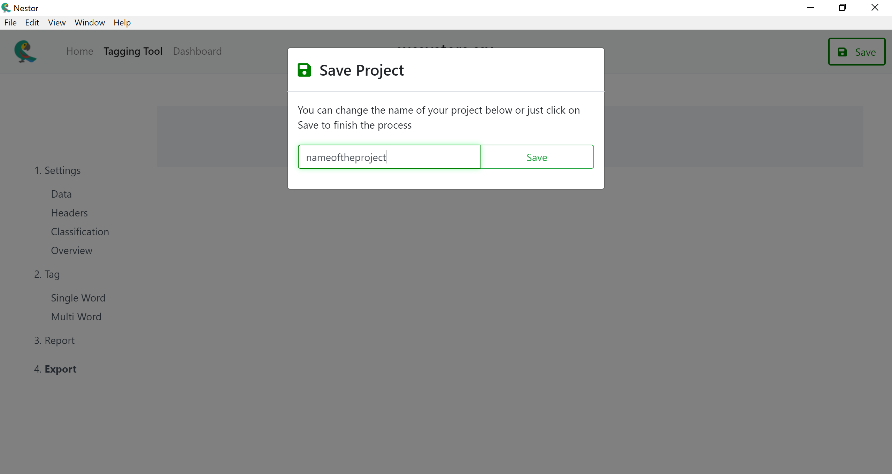
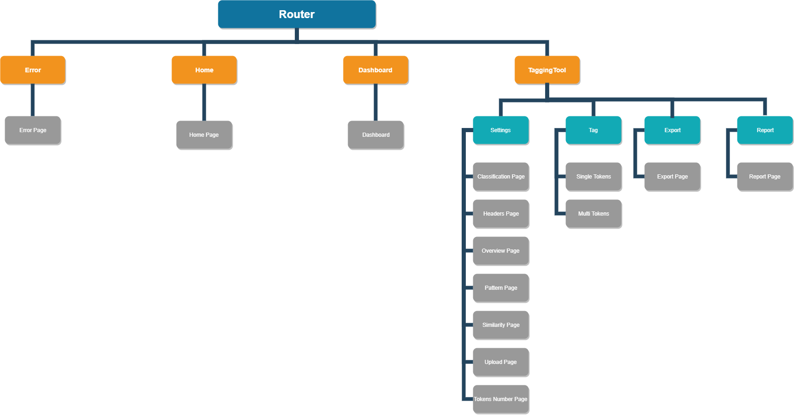

# How We Made It

## Introduction

### References

Previous Nestor documentation
<https://buildmedia.readthedocs.org/media/pdf/nestor/latest/nestor.pdf>

## Description

This electron application is an alternative version of the previous Nestor-qt GUI. It will not require any prior Nestor installation from the user
and will be accessible via an executable file for windows machines.

Nestor-web features are identical to the previous nestor
application, however they are part of a new web-based GUI.

### Features

#### List of Nestor-web main features.
*  Settings
*  Upload a file
*  Extract user selected data
*  Set the similarity
*  Get an overview of all settings
*  Tagging
*  Extract 'tf-idf' ranked tokens
*  Get 'fuzzy wuzzy' synonyms for each token
*  Tag the tokens
*  Report
*  Get information on tagged tokens
*  Export
*  Export to a csv file the progress in the form of two vocabulary files, and 'readable tags' file.
*  Create, save, open and delete projects from imported csv file

### Phases

1.  Design Marvel App
2.  Create React Application
3.  Find Back End
4.  Integrate Front end and Back end with Electron
5.  Cycle of development : integration of new features 

### General Architecture

### Operating environment

The application has 3 versions : Windows, Linux, Mac. The application is
stand alone and doesn't require any installation, it will function on any
machine (as long as it has been packaged for the machine's
architecture). Currently, due to zerorpc issues, each packaged
application is packaged on the targeted platform.

## Content structure 

The main components interacting together in this application are :
*  Electron main process
*  React source files
*  Python Server
*  Python Package

### Design

Nestor web views were designed using Marvel, an application to create a
prototype of digital products with wireframes.

<https://marvelapp.com/466i27h/screen/48984978>

Screenshots of the application :

       
       
       
       
      
     

### Software user interfaces

This section concerns the technical choices of the nestor web
application. For reminder, the application is built with React, python,
electron and zerorpc.

**Why React ?**

React is faster than vanilla javascript because of its use of the
virtual DOM.

React uses jsx components, these reusable components allow the codebase
to become very modular. Finally the framework is highly maintained by a
large community.

The application was bootstrapped with the create-react-app project
because of all the boiler plate code used in it. It contains a
development server, webpack for bundling files, babel for compiling
javascript code and jsx code, the hot module reloading. It is possible
to easily customize configuration for production.

On the server side React is also platform agnostic. Which means we can
use any options to serve our React application.

The application was designed with a server side Nodejs backend written
in javascript communicating with a python server written in python as
well as a javascript front end application.

A system of data persistence has been integrated into the application to
enable users to save their actions done on the application. The database
management is made with the technology pouchDb, built on top of the most
known CouchDB database.

**Why POuchDB ?**

PouchDB is an in-browser database that allows applications to save data
locally, so that users can enjoy all the features of an app even when
they\'re offline. Plus, this database is embeddable in an Electron
requirement which is a must-have requirement for this project due to the
deployment of the project.

Finally, pouchDB is currently used by many developers and has a really
large community to deal with potential troubleshouting. The database
storage is only limited by the client's machine currently, but it can be
set in the source code.

The communication between the python script (where all the data
manipulation is done) and the frontend is made by zerorpc sockets. With
zerorpc technology, we basically create a server for the python script,
which we are going to call from the frontend part when we need the data.

**Why Electron ?**

Electron uses Nodejs and that's the reason why it has faster response
time, fewer server side code, fewer files. Usually, codebases are more
consistent and highly scalable.

Electron is part of a large ecosystem of open-source libraries that make
it great for prototyping.

It allowed us to create an offline application that does not need to be
connected to any server. Electron is the technology that enables us to
package the application and its different parts (react frontend, python
script) and to launch these parts at the launching of the application.

**Why Python ?**

Python is used in the application to use the functions exposed by the
nestor package. It was a natural choice as it's the most convenient to
match python with itself in a coding mindset.

**Why zerorpc ?**

Zerorpc is a technology built on top on zeromq, and is used to ensure
the communication between the react frontend server and the python
server. Basically this technology enables us to open socket between the
two servers.

### Assumptions / Dependencies

Minimum requirements for running an electron application are:

**Windows**

* Both x86 and amd64 (x64) binaries are provided for Windows

**Mac**

* Only 64bit binaries are provided for macOS, and the minimum macOS version supported is macOS 10.10.

**Linux**

* The prebuilt ia32(i686) and x64(amd64) binaries of Electron are built on Ubuntu 12.04, the arm binary is built against ARM v7 with hard-float ABI and NEON for Debian Wheezy.
* Ubuntu 12.04 and later
* Fedora 21
* Debian 8

About RAM and CPU, there are no information about that in Electron\'s
docs, but Electron is based on Chromium, so it should need nearly the
same requirements:

**Windows**

* An Intel Pentium 4 processor or later that\'s SSE2 capable
* 512 MB of RAM

**Mac**

* An Intel processor that\'s 64-bit
* 512 MB of RAM

**Linux**

* An Intel Pentium 4 processor or later that\'s SSE2 capable

More information available [here](#<https://electronjs.org/docs/tutorial/support>)

## System features

### React application

Client-side routing diagram

Currently, the routes to the pattern, similarity, and tokens number page
are blocked on purpose. The react application file structure is grouped
by routes. Each page is grouped with a css sheet, the actual jsx
component, the store's reducer and the store's action functions.

### Additional nonfunctional requirements

#### Accessibility

The application was made to support multi languages.

To add a new language, write a new json translation file under
src/language.

#### Security

Electron applications run as offline application.

Data is permanent during a session, but no data is transmitted to NIST
servers. The user can use the export functionalities to persist the data
from a session in csv files that will be downloaded locally to his
machine.

The data persistence between several sessions ensured by pouchDB, is an
in-browser database so that the data stays on the client's laptop.

#### Performance

Electron applications tends to be large because they bundle most of
Chromium. Additionally, there is no sharing of resources meaning
Electron application take up more space and memory than native
applications which were developed with a specific platform in mind.

#### Software quality

The application uses React Redux to manage the store. The store is organized 
with reducers that corresponds to components. You can find more informations 
about React-Redux [here](https://react-redux.js.org/).

You can find the documentation of this project by generating it through the 
process explained in the `README.md` file of this project. 

## Appendices

### Appendix A: Analysis Documentation

Nestor previous documentation :
<https://nestor.readthedocs.io/en/latest>

GitHub repository Nestor web : <https://github.com/usnistgov/nestor-web>

### Appendix B: Issues
------------------

Updated board of unresolved issues, pending decisions and next features
to develop :

<https://gitlab.nist.gov/gitlab/kea/nestor-web/-/boards>

