# Nestor User Guide

Developed by

- **Cedric Bell** : Nestor web developer (2019-2020)
- **Sakina Laanani** : Nestor web developer (2018-2019)
- **Thurston Sexton** : Nestor Lead
- **Michael Brundage** : Project Lead 

## Introduction

This user guide of the Nestor application addresses how to use the web version of Nestor. 
The goal of the web version is to present with a more user
friendly Graphical User Interface (GUI) design with the same features as previous versions of 
[Nestor](https://nestor.readthedocs.io/en/latest/index.html). 
The original version of Nestor is still available on [Github](https://github.com/usnistgov/nestor). 

## 1. Settings

### 1.1 Home 

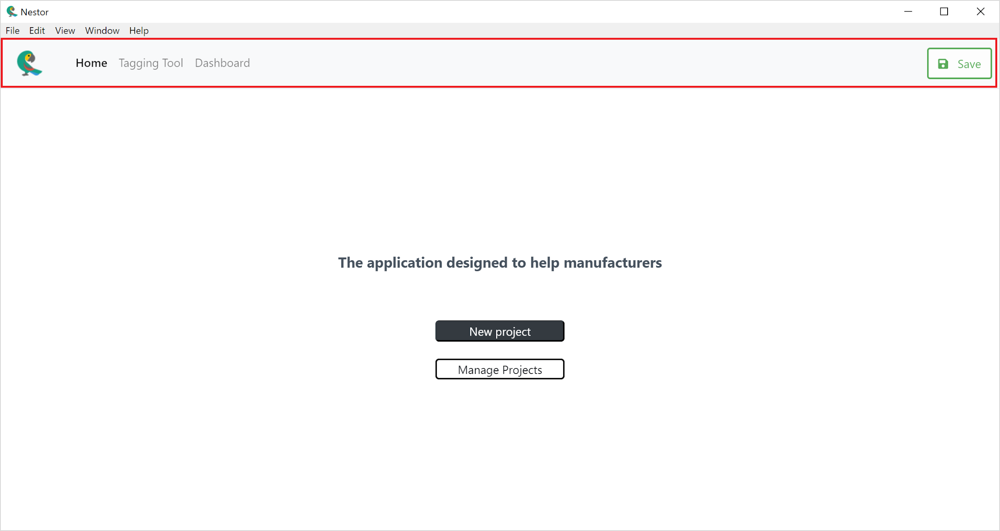

<strong>figure 1 : Home page of Nestor (header
in red)</strong>
 

  
When the application starts, a loading screen will appear followed by [figure 1](#11-home). 
A user can navigate to the tagging tool and
the dashboard through the header at any time. On this header, there is also a save
button which will remain disabled unless you start a new project. The header also displays the current project's name.
Clicking on the new project button will redirect to the upload page ([figure 3](#13-upload-a-file)). 
Clicking on the manage projects button will prompt the following screen [figure 2](#12-manage-projects).

 

### 1.2 Manage projects 

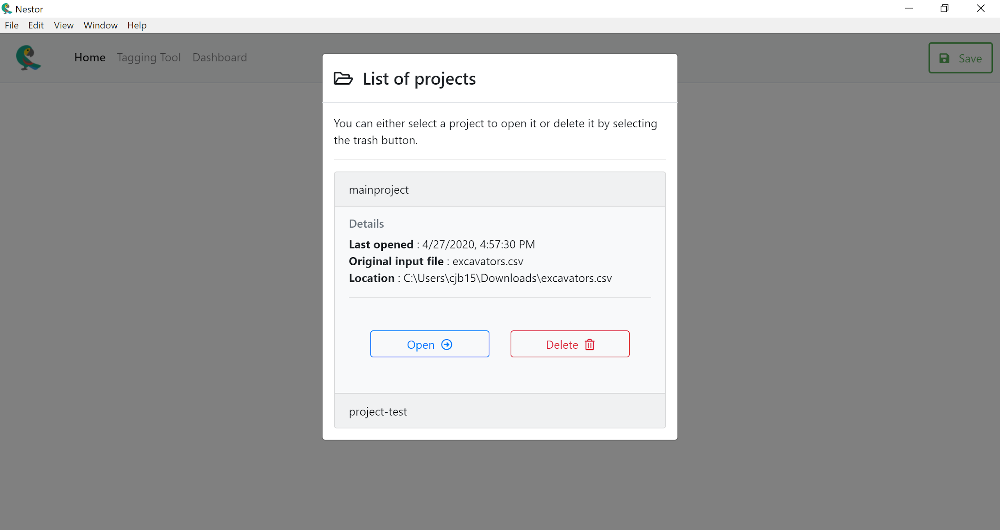

<strong>figure 2 : Manage project popup</strong>
 

This popup is opened when a user clicks on the Manage projects button in the
home page. On this popup, a user can select one project from their projects
list and then either open or delete it. 
When a user deletes one project, it will not appear in the project list.
Opening a project will redirect to the Overview tab ([figure 6](#16-overview)) with all
the loaded settings and tagged tokens of the previous saved state.
If no projects are saved, a user will be prompted to create a new project. 

 

### 1.3 Upload a file 
-----------------

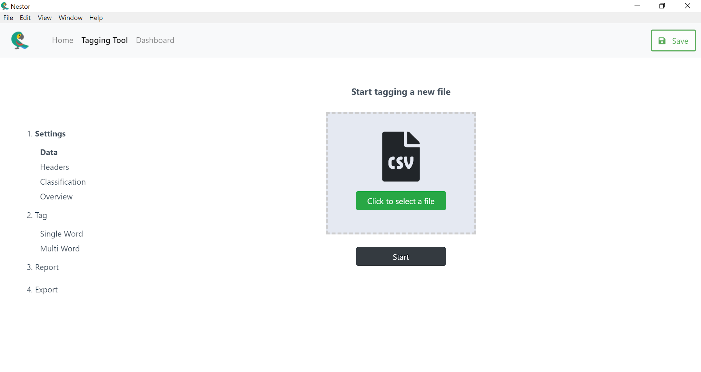

<strong>figure 3 : Upload a new file</strong>
 

The "select a file" green button asks for the csv file for input. Once a file is uploaded successfuly, the name of the file will appear below the green button. 
Clicking on the start button directs the user to [figure 4](#14-select-columns) below.

 

### 1.4 Select columns
------------------

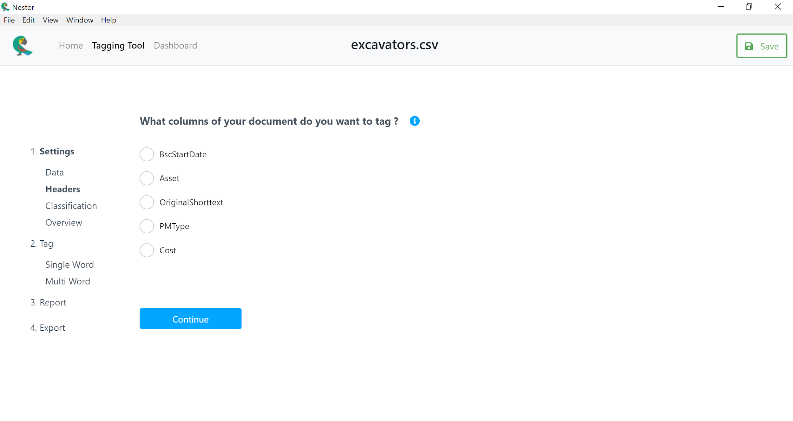

<strong>figure 4 : Select columns page</strong>
 

In this tab, the user selects the columns which will be the tagged. The application will provide the headers of the csv file to aid the user in selecting these columns. 
The user should select the natural language columns, as of now Nestor cannot tag dates or numbers. 
Some improvements are under development to better handle these types of columns. 
Hovering the mouse on the column's name will preview what is in each column. Once the columns that will be tagged are selected, click Continue [figure 5](#15-classification).

### 1.5 Classification 
------------------

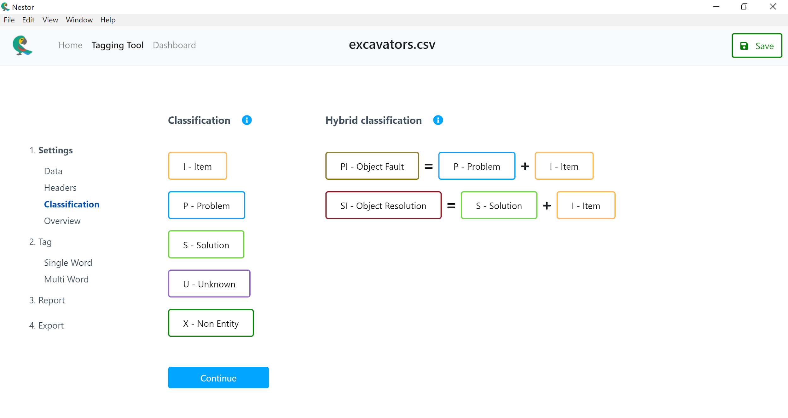
-----------------------------------------------------------------------

<strong>Figure 5 : Classification explanation</strong>
 

This page shows the tag types. As of now, tokens can be classified as item, solution, problem, unknown and
non entity. Moreover, two hybrid classifications are available for the
multiTokens : Object Fault which links problem and item pairs and an Object Resolution, which links solution and item pairs.
Hovering over each will give an explanation. 
(). Next, click on the Continue tab ([figure 6](#16-overview)).

### 1.6 Overview
------------

<strong>Figure 6 : overview of your settings</strong>
 

This page summarizes previously selected settings: the columns that will be input for tagging and classification types. The page provides a duration time, which is an 
estimated value of how long it will take to tag a specific number of tokens. Clicking on Continue will bring the user to ([figure 7](#2-tagging-tool))

## 2. Tagging tool

### 2.1 SingleTokens
----------------

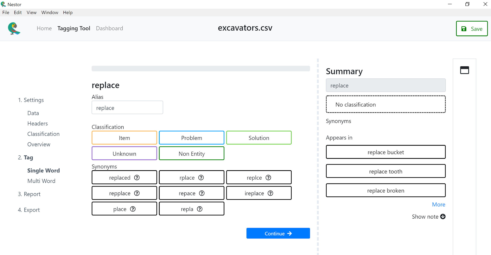

<strong>figure 7 : single tokens page</strong>
 

The tagging tool is separated into two parts: the tagging section (on the left) and a summary area which gets updated automatically when a user tags a token. 
In the tagging section, a user uses the Alias field to rename the token and related concepts (e.g., hyd may get an alias of hydraulic). The user also selects the classification for each token (e.g., hydraulic is an item). During this step, the user will also link any other similar concepts based on misspellings, jargon, or abbreviations. The tool tip icon
 will show where each of these words occur in the data. This will provide context to help the user make decisions on what concepts should be linked together. 

Figure 8, shows how synonyms are linked. The selected
synonyms can be deselected if
needed.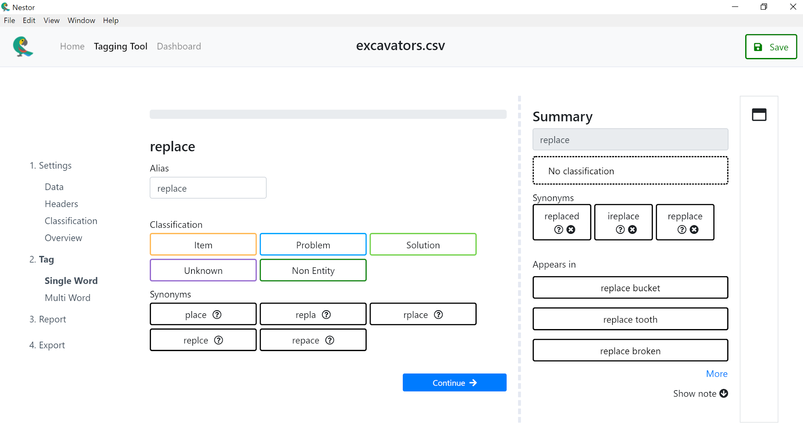

<strong>Figure 8 : single tokens with synonyms selected</strong>
 

Figure 9 shows an alert message that appears if the user does not select a classification. If a user is not sure about a classification, they can select Unknown.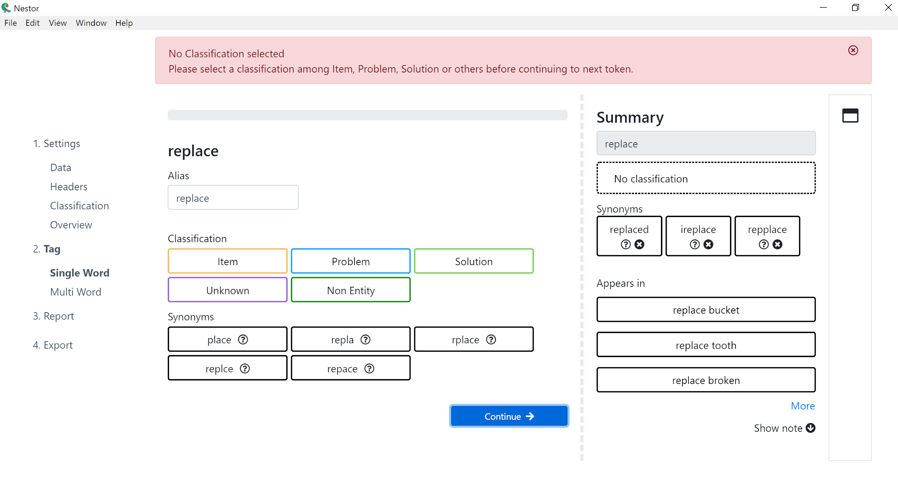

<strong>Figure 9 : single tokens with alert message</strong>
 

Figure 10 shows the progress bar that updates as the user progresses through the tagging process. 
This progress bar shows the percentage of the original file that has some information added by Nestor. As an example, if the progress bar shows 40%, it means
that on 40% of the rows of the original file you have tagged at least
one token. 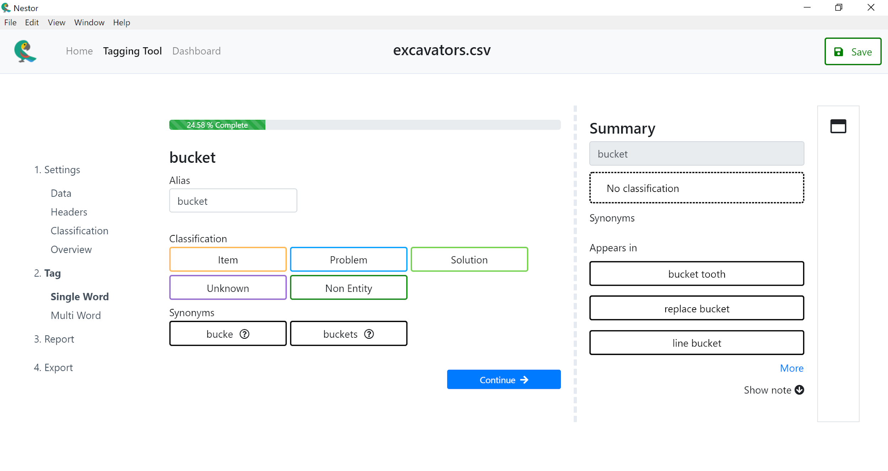

<strong>Figure 10 : progress bar updated</strong>
 

The summary section shows a selection of multi-token phrases that contain the single token a user is currently working on. Multi-tokens are pairs of tokens that appear together. 
This allows a user to navigate from single to multi-token tagging easily. The More button displays more multi-token pairs if a user would like to see all instances of the current token in multi-token pairs. 

### 2.2 Multi Tokens
----------------

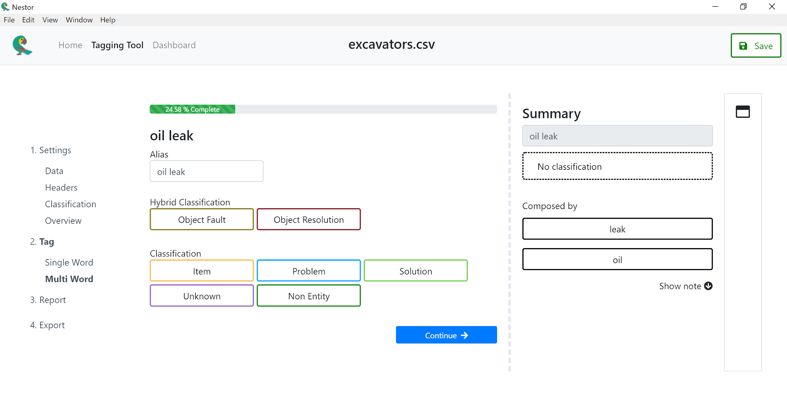

<strong>Figure 11 : multi tokenpage</strong>
 

The multi token page is very similar to the single token one with some minor differences. 
First, this page allows for classification of multi-token phrases, which enables the Object Fault and Object Resolution token classifications. 
Second, the summary page contains a link to the single token page with each word in the multi-token pair. This allows the user to navigate between both the single token and multi-token pages. 

### 2.3 Search tokens
-----------------

<strong>Figure 12 : search feature</strong>
 

To search for a specific token, use this icon
. This displays the different tokens as shown in figure 12's popup window.
This popup window allows a user to search for any token within the dataset. 
The user can also search alphabetically for a specific token as shown in figure 13. 

<strong>Figure 13 : search feature - alphabetical filter</strong>
 

### 2.4 Save a project
------------------

<strong>Figure 14 : saving action</strong>
 

As a user progresses through the tagging process, they can save the project locally. The data you imported in this project will only remain in the user's laptop in the AppData directory. Figure 14 shows how the user can change the name of the project and resave if needed. 

## 3. Report
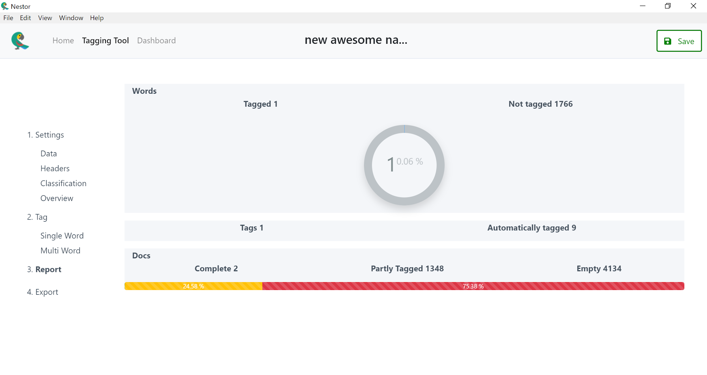

<strong>Figure 15 : report page</strong>
 

This page provides a quick summary of the project. In this example, the user tagged 1 word with 9 synonyms
selected, which are located in 24.58% of the lines of the original file.
There are still 1766 potential tokens to tag.

## 4. Export

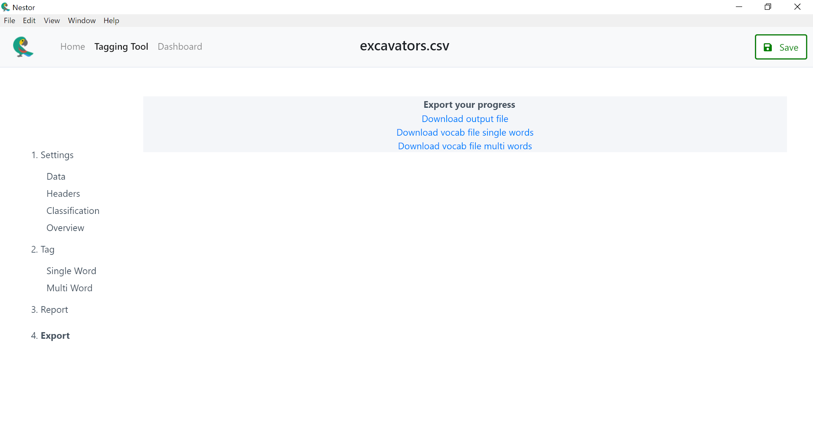

<strong>Figure 16 : export page</strong>

In this page, the user can download some outputs of the application :

-   the output file : readable csv of the original data and the tokens with their tags.

-   The vocab file single words : list of the single tokens tagged
    > ranked by 'tf-idf' with their tag and their score.

-   The vocab file multi words : list of the multi word tokens tagged
    > ranked by 'tf-idf' with their tag and their score.

## 5. Other information

The Nestor application saves everything locally, no data is transmitted. 

The storage capacity limit is based on the user's storage capacity. 
